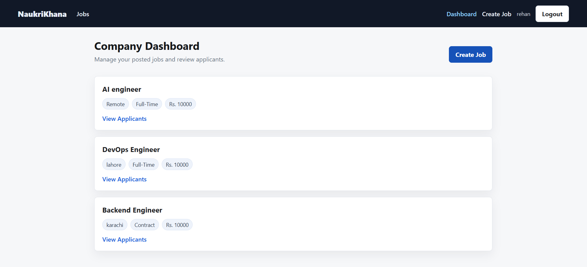

# NaukriKhana Job Board Portal

NaukriKhana is a mini job board built with React, Node/Express, MongoDB, JWT authentication, and role-based access. Candidates can browse and apply for jobs, while companies can post jobs and view applicants.

## Features

- User registration and login with JWT authentication
- Role support for `candidate` and `company`
- Public job listing with filters for location, type, and minimum salary
- Job detail page with candidate application form
- Company-only job creation
- Company dashboard showing only that company's posted jobs
- Applicant list for each company job
- Protected frontend routes based on login state and role
- Docker setup for frontend, backend, and MongoDB

## Screenshots

### Company Dashboard



## Tech Stack

- Frontend: React, Vite, React Router, Axios
- Backend: Node.js, Express, Mongoose
- Database: MongoDB
- Auth: JWT, bcryptjs
- Containers: Docker, Docker Compose, Nginx

## Project Structure

```text
NaukriKhana/
  backend/
    config/
    controllers/
    middleware/
    models/
    routes/
    server.js
    Dockerfile
  frontend/
    public/
    src/
      api/
      App/
      components/
      context/
      pages/
    Dockerfile
    nginx.conf
  docker-compose.yml
```

## Environment Variables

Create `backend/.env`:

```env
PORT=5000
MONGO_URI=mongodb://localhost:27017/naukrikhana
JWT_SECRET=your_jwt_secret_here
```

For Docker Compose, `MONGO_URI` is overridden to use the Mongo service:

```env
MONGO_URI=mongodb://mongo:27017/naukrikhana
```

The frontend API URL defaults to:

```env
VITE_API_URL=http://localhost:5000/api
```

## Run Locally

Install backend dependencies:

```bash
cd backend
npm install
npm run dev
```

Install frontend dependencies in another terminal:

```bash
cd frontend
npm install
npm run dev
```

Local URLs:

```text
Frontend: http://localhost:5173
Backend:  http://localhost:5000
```

Make sure MongoDB is running locally before starting the backend.

## Run With Docker Compose

From the project root:

```bash
docker compose up --build
```

Docker URLs:

```text
Frontend: http://localhost:80
Backend:  http://localhost:5000
MongoDB:  localhost:27017
```

Stop containers:

```bash
docker compose down
```

Stop containers and remove MongoDB volume:

```bash
docker compose down -v
```

## Docker Hub Images

Updated images are available at:

```text
hopzalot/naukrikhana-frontend:latest
hopzalot/naukrikhana-backend:latest
```

Pull manually:

```bash
docker pull hopzalot/naukrikhana-frontend:latest
docker pull hopzalot/naukrikhana-backend:latest
```

## API Endpoints

Base URL:

```text
http://localhost:5000/api
```

### Auth

```text
POST /auth/register
POST /auth/login
```

Register body:

```json
{
  "name": "Company User",
  "email": "company@example.com",
  "password": "password123",
  "role": "company"
}
```

Login body:

```json
{
  "email": "company@example.com",
  "password": "password123"
}
```

### Jobs

```text
GET  /jobs
GET  /jobs/:id
POST /jobs
```

`POST /jobs` requires a company token.

Job body:

```json
{
  "title": "Frontend Intern",
  "description": "Build and maintain React interfaces.",
  "salary": 50000,
  "location": "Karachi",
  "type": "Internship"
}
```

Job filters:

```text
GET /jobs?location=Karachi&type=Internship&salary=30000
```

### Applications

```text
POST /applications/:id/apply
GET  /applications/:id/applications
```

`POST /applications/:id/apply` requires a candidate token. The `:id` is the job ID.

Application body:

```json
{
  "name": "Candidate User",
  "email": "candidate@example.com",
  "resumeLink": "https://example.com/resume.pdf"
}
```

`GET /applications/:id/applications` requires a company token and returns applicants for that job.

## User Flow

1. Register as a company.
2. Create a job from the company dashboard.
3. Register or login as a candidate.
4. Browse jobs and use filters.
5. Open a job detail page and apply with name, email, and resume URL.
6. Login as the company and view applicants from the dashboard.

## Notes

- Candidate accounts cannot create jobs or view applicants.
- Company accounts cannot apply to jobs.
- Resume URL should include a valid URL such as `https://...`.
- The frontend uses `localStorage` to store the JWT token and user details.
